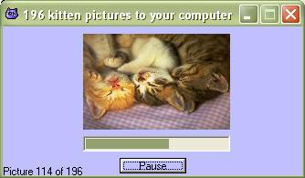

<div align="center">

## Download 196 Cute kittens


</div>

### Description

This program connects to http://kittens.sytes.org/ and downloads all their cute kitten pictures.

The program is nice commented and easy to understand.

Feedback, bug reports and suggetions, greatly appreciated
 
### More Info
 


<span>             |<span>
---                |---
**Submitted On**   |2004-09-14 14:51:04
**By**             |[Mike Kosmatopoulos](https://github.com/Planet-Source-Code/PSCIndex/blob/master/ByAuthor/mike-kosmatopoulos.md)
**Level**          |Beginner
**User Rating**    |4.8 (24 globes from 5 users)
**Compatibility**  |VB 6\.0
**Category**       |[Internet/ HTML](https://github.com/Planet-Source-Code/PSCIndex/blob/master/ByCategory/internet-html__1-34.md)
**World**          |[Visual Basic](https://github.com/Planet-Source-Code/PSCIndex/blob/master/ByWorld/visual-basic.md)
**Archive File**   |[Download\_11793559142004\.zip](https://github.com/Planet-Source-Code/mike-kosmatopoulos-download-196-cute-kittens__1-56184/archive/master.zip)

### API Declarations

```
Private Declare Function URLDownloadToFile Lib "urlmon" Alias "URLDownloadToFileA" (ByVal pCaller As Long, ByVal szURL As String, ByVal szFileName As String, ByVal dwReserved As Long, ByVal lpfnCB As Long) As Long 'Api to download a file
```


